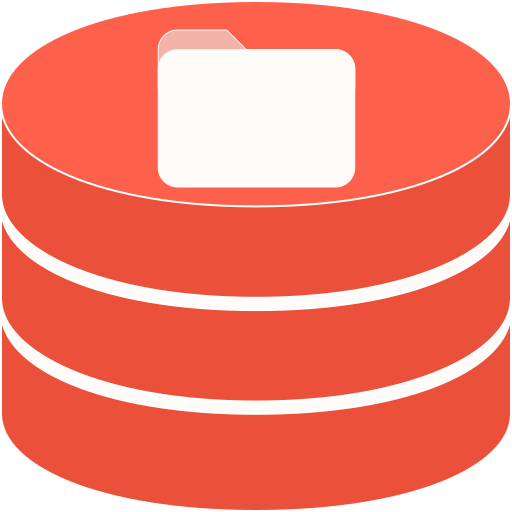
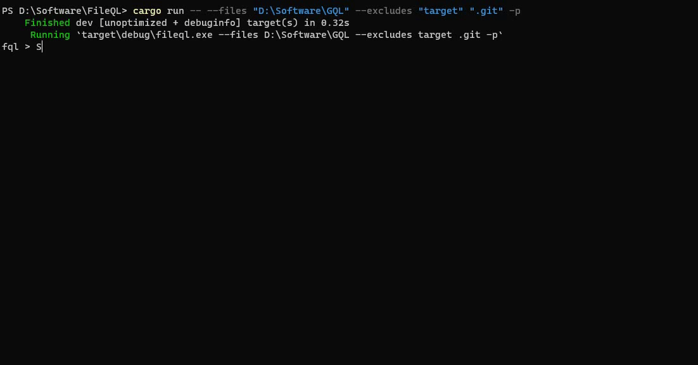

<h1 align="center">FileQL - File Query Language</h1></br>

<p align="center">

</p>

<p align="center">
  
  
  
  
  
  
  
</p>

<p align="center">
FileQL is a tool that allow you to run SQL-like query on local files instead of database files using the GitQL SDK.
</p>

<p align="center">
  
</p>

---

### Samples

Note that all Keywords in FileQL are case-insensitive, similar to SQL.

```sql
SELECT 1
SELECT 1 + 2
SELECT LEN("File Query Language")
SELECT "One" IN ("One", "Two", "Three")
SELECT "File Query Language" LIKE "%Query%"

SELECT * FROM files
SELECT COUNT(path) from files
SELECT DISTINCT parent AS folders FROM files
SELECT CHILDREN_COUNT(parent) FROM files
```

---

### Files table structure

| Name      | Type    | Description              |
| --------- | ------- | ------------------------ |
| path      | Text    | File path                |
| parent    | Text    | File parent path         |
| extension | Text    | Extension of the file    |
| is_dir    | Boolean | True if it's a directory |
| is_file   | Boolean | True if it's a file      |
| size      | Integer | Size of the file         |

---

### Files QL Functions

| Name        | Parameters | Return  | Description                                                  |
| ----------- | ---------- | ------- | ------------------------------------------------------------ |
| FILES_COUNT | Text       | Integer | Number of children for directory or 0 if it's not valid path |

---

### Download or Install

- Install from Cargo.io

```
cargo install fileql
```

- Install from Winget

```
winget install fileql
```


- Build from source code

```
git clone https://github.com/AmrDeveloper/fileql.git
cd fileql
cargo build
```

### Run FileQL

```
FileQL is a SQL like query language to run on local files
Usage: FileQL [OPTIONS]

Options:
  -f,  --files <paths>        Path for local files to run query on
  -e,  --excludes <paths>     Path for local files to exclude from query scope
  -q,  --query <GQL Query>    FileQL query to run on selected files
  -p,  --pagination           Enable print result with pagination
  -ps, --pagesize             Set pagination page size [default: 10]
  -o,  --output               Set output format [render, json, csv]
  -a,  --analysis             Print Query analysis
  -h,  --help                 Print FileQL help
  -v,  --version              Print FileQL Current Version
```

### License
```
MIT License

Copyright (c) 2024 Amr Hesham

Permission is hereby granted, free of charge, to any person obtaining a copy
of this software and associated documentation files (the "Software"), to deal
in the Software without restriction, including without limitation the rights
to use, copy, modify, merge, publish, distribute, sublicense, and/or sell
copies of the Software, and to permit persons to whom the Software is
furnished to do so, subject to the following conditions:

The above copyright notice and this permission notice shall be included in all
copies or substantial portions of the Software.

THE SOFTWARE IS PROVIDED "AS IS", WITHOUT WARRANTY OF ANY KIND, EXPRESS OR
IMPLIED, INCLUDING BUT NOT LIMITED TO THE WARRANTIES OF MERCHANTABILITY,
FITNESS FOR A PARTICULAR PURPOSE AND NONINFRINGEMENT. IN NO EVENT SHALL THE
AUTHORS OR COPYRIGHT HOLDERS BE LIABLE FOR ANY CLAIM, DAMAGES OR OTHER
LIABILITY, WHETHER IN AN ACTION OF CONTRACT, TORT OR OTHERWISE, ARISING FROM,
OUT OF OR IN CONNECTION WITH THE SOFTWARE OR THE USE OR OTHER DEALINGS IN THE
SOFTWARE.
```
